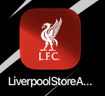
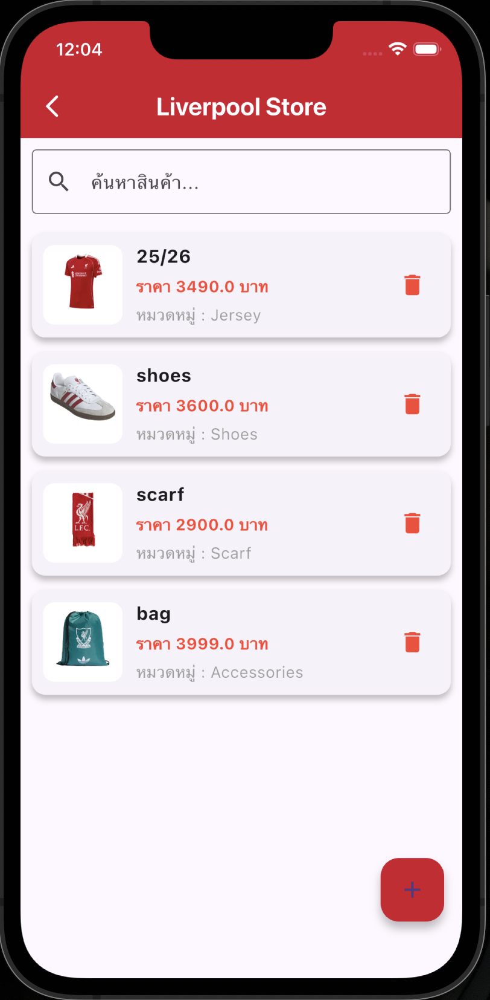

# liverpool_store_app

A new Flutter project.

## Getting Started

This project is a starting point for a Flutter application.

A few resources to get you started if this is your first Flutter project:

- [Lab: Write your first Flutter app](https://docs.flutter.dev/get-started/codelab)
- [Cookbook: Useful Flutter samples](https://docs.flutter.dev/cookbook)

For help getting started with Flutter development, view the
[online documentation](https://docs.flutter.dev/), which offers tutorials,
samples, guidance on mobile development, and a full API reference.
=======
# liverpool_store_app

 
 
 
Liverpool Store App เป็นแอปพลิเคชันที่พัฒนาด้วย Flutter สำหรับใช้ในการ จัดการข้อมูลสินค้า ภายในร้านค้า โดยผู้ใช้สามารถเพิ่ม แก้ไข ลบ และดูรายละเอียดสินค้าได้ พร้อมทั้งมีระบบค้นหาสินค้าและ Dashboard สำหรับแสดงสถิติสินค้า

ระบบใช้ SQLite เป็นฐานข้อมูลภายในเครื่องสำหรับเก็บข้อมูลสินค้า และใช้ Provider เพื่อจัดการ State ของแอป ทำให้เมื่อข้อมูลมีการเปลี่ยนแปลง หน้าจอของแอปจะอัปเดตโดยอัตโนมัติ

ภายในระบบมีหน้าจอหลัก ได้แก่
Product List แสดงรายการสินค้า
Product Detail แสดงรายละเอียดสินค้า
Product Form สำหรับเพิ่มและแก้ไขสินค้า
Dashboard แสดงสถิติข้อมูลสินค้า

ผู้ใช้สามารถค้นหาสินค้า เพิ่มสินค้าใหม่ แก้ไขข้อมูลสินค้า และลบสินค้าได้ โดยข้อมูลทั้งหมดจะถูกบันทึกลงในฐานข้อมูล SQLite ภายในเครื่อง
โดยรวมแล้วระบบนี้เป็น แอปจัดการสินค้าพื้นฐาน ที่มีการใช้ Flutter, SQLite และ Provider เพื่อพัฒนาแอปพลิเคชันที่สามารถจัดการข้อมูลได้อย่างมีประสิทธิภาพ
